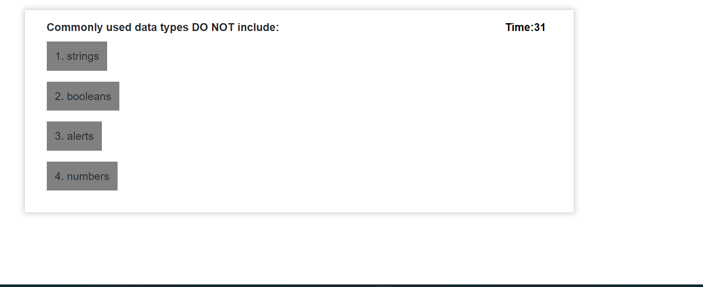

# quiz

# Code-Quiz

 

This is a quiz application using HTML, CSS, and Javascript. This application emphasizes the use of Javascript to provide quiz questions and collect user data to determine whether the answers to a question are correct, this then generates a score and appends a final page of results from the user data. 

This project has been deployed to GitHub Pages. To get this project up and running, you can follow the deployment link. Or, download the sources files to use this as a template.
https://github.com/LipikaManglaa/quiz.git
* [GitHub Repository](https://github.com/LipikaManglaa/quiz.git)
* [Deployed GitHub IO] https://lipikamanglaa.github.io/quiz/

### Prerequisites

To install this application, you will need a text editor. I recommend Visual Studio Code. 

### Installing

To install this code, download the zip file, or use GitHub's guidelines to clone the repository. 

### Summary
* HTML and CSS and Javascript documents create a quiz with 5 multiple choice questions with Javascript 
* This project emphasizes the use of using Javascript to make dynamic changes to an HMTL document

### This project has the following features: 
* A Start Quiz button 
    * This starts a timer for the user
    * Each question averages 15 seconds each for a total time of 60 seconds . 

* An appended HTML page that features questions, and multiple choice answers
    * If questions are answered incorrectly, 15 seconds are deducted off remaining time
   

* An appended HTML page that features: 
    * Final score which is calculated using time remaining
   
    * Input area to record initials
    * A Submit button
    * Submit buttom saves initials and score to local storage

* A Highscores HTML
    * This a list summary of intials and final scores
    * Clear button resets the page and local storage
    * Go back button travels to the start of the quiz

### Psuedo code:  
* Create a timer attached to a button with a starting value of 60

* When countdown starts, start quiz
* Start Quiz will be on appended page
* Append the question: choices
* When user selects the right answer, textcontent "Correct!"
* When user selects the right answer, textcontent "Incorrect!"
* Final score will keep track of how many the user got right 
* Final Score Appended page 
* Captures local storage
* Travels to another HTML
* Retrieved highscores

### This project has script features of:
* Questions contained in an array variable with objects
* Variable declaration area 
* A function to render the questions and choices on the page using a for loop
* An event listener on all list choices 
* A comparison statement to compare correct answers to choices
* An appended page showing the final stats of the individual user with input area for initials, captures local storage
* Highscores retreived local storage

### This project has media Queries for:

* max-width: 991px 
    * Adjusts body and container width
* max-width: 767px
    * Adjusts body and container width
    * Adjusts buttons
* max-width: 567px
    * Adjusts body and container width
    * Adjusts buttons to be centered and stacked

### To Execute File:
> Open in browser

### Features: 
* Two HTML Pages
    * Index.html 
        * Contains landing page to start timer
        * Appends two new pages 
* Highscores 
        * Retreives local data from previous page
* One CSS Page
    * Styles.css
        * Contains centering and styling for html list features
        * Contains media queries
* Two Javascript Page
        * Contains: 
        * Variables, including arrays with object
        * Event listeners
        * if/else if statements
        * For Loops
        * Functions 
        * Local Storage set and get 

